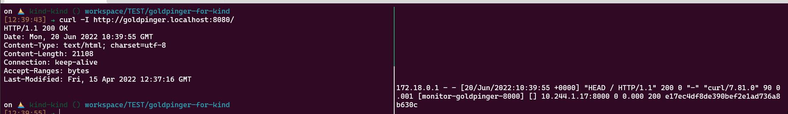

# Description

Kind will let you access your cluster from an ingress if you specify it explicitly in the kind configuration file.
So to access nginx ingress controller 80 port, we will need to target port "hostPort" as defined in the kind config.  

## 0. KIND on WSL 2
- https://kind.sigs.k8s.io/docs/user/using-wsl2/

cd
go install sigs.k8s.io/kind@v0.14.0

export GOPATH=$HOME/go
export GOBIN=$HOME/go/bin
export PATH="${PATH}:${GOBIN}"
  
`kind create cluster --config=kind-configs.yml `

## 1. Nginx
We need a special configuration for nginx to work in Kind so we can do it manually from this resource definition:
`kubectl apply -f charts/nginx/`

- https://raw.githubusercontent.com/kubernetes/ingress-nginx/main/deploy/static/provider/kind/deploy.yaml
- Read [here](https://github.com/helm/helm/issues/5753) if you're curious why it is suggested to ceate the namespace before helm create.


## 2. Prometheus

```
helm repo add prometheus-community https://prometheus-community.github.io/helm-charts
helm repo update
helm install prometheus-stack prometheus-community/kube-prometheus-stack \
    --values charts/prometheus/values-kube-prometheus-stack.yaml \
    --namespace monitor

```
- https://artifacthub.io/packages/helm/prometheus-community/kube-prometheus-stack


## 3. Goldpinger

```
echo "127.0.0.1 goldpinger.localhost"|sudo tee -a /etc/hosts

helm repo add okgolove https://okgolove.github.io/helm-charts/
helm install goldpinger okgolove/goldpinger \
    --values charts/goldpinger/values.yaml  \
    --namespace monitor

```



- https://artifacthub.io/packages/helm/okgolove/goldpinger
- https://github.com/bloomberg/goldpinger


## 4. Metrics Server
```
helm repo add metrics-server https://kubernetes-sigs.github.io/metrics-server/
helm repo update
kubectl create ns metrics
helm upgrade --install metrics-server metrics-server/metrics-server --namespace metrics 

kubectl patch deployment -n metrics --type=merge metrics-server --patch-file=metrics-server/metrics-server-unsecure.yml

kubectl rollout restart deployment -n metrics metrics-server
kubectl logs -n metrics  -l app.kubernetes.io/instance=metrics-server
```